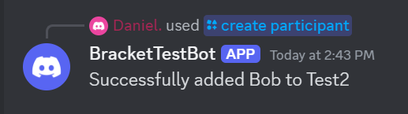

# Bracket Bot
#### Still work in progress | Made using discordgo / GoLang
#### A discord bot that utilize Challonge API to manage tournaments from just discord
#### Must have a Challonge account

````
TODO:
UPDATE README
Code cleanup
Implement bracket image 
Better list for matches
Allow admin to set certain role to certain commands
need more ideas
````

### SETUP:
Create a role and get the ID of the discord role that you want be able to access certain commands\
Create a config.toml file with this format \
You can get Challonge API v1 key from here : https://challonge.com/settings/developer
````
[Bot]
token  = {discord bot token goes here}
guild_id = {discord server id goes here}
ModRole_ID = {Role ID of the role you want access to add/remove participants cmd} 

[API]
token = {challonge api key goes here}
````
Put config.toml in root directory where the bot folder is located\
After setting up config file, you can just run ``go run main.go``

### Commands:

```
/create tournament {name} {tournament_type} {game_name} {start_time}
- Create a tournament
```


```
/update tournament {tourney-id} {name} {tournament_type} {game_name} {start_time} {check_in}
- Update a tournment with options
```


````
/show all tournaments 
- Shows all tournaments
````

````
/show tournament {tourney-id} 
- Shows information of the tournament with given ID
````

````
/show all participant {tourney-id} 
- Shows all participant in that tournament with given ID
````

````
/show participant {participant-id} {tourney-id} 
- Show a participant information in that tournament with given IDs
````

````
/create participant {tourney-id} {name} {discorduser} optionals : {seed}
- Add a participant with those parameters
- Requires role to be set in config.toml to use this command
````


````
/removeparticipant {tourney-id} {name} 
- Removes a participants from tournament
- Requires role to be set in config.toml to use this command
````


````
/updateparticipant {tourney-id} {name} {options}
- Updates a participant information in a tournament
- Requires role to be set in config.toml to use this command
````

````
/showmatch {match-id} {tourney-id}
- Shows a single match from a tournament
````

````
/showmatches {tourney-id}
- Shows all matches from a tournament
````

````
/updatematch {match-id} {tourney-id} {options}
- Update a match with options
````


