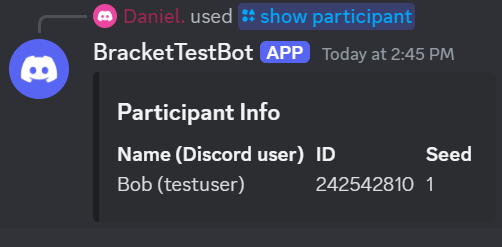

# Bracket Bot
#### Still work in progress | Made using discordgo / GoLang
#### A discord bot that utilize Challonge API to manage tournaments from just discord
#### Must have a Challonge account

````
TODO:
Allow admin to set certain role to certain commands
Update tournament
Delete tournament
Create tournament
need more ideas
````

### SETUP:

Create a config.toml file with this format \
You can get Challonge API key from here : https://challonge.com/settings/developer
````
[Bot]
token  = {discord bot token goes here}
guild_id = {discord server id goes here}
ModRole_ID = {Role ID of the role you want access to add/remove participants cmd} 

[API]
token = {challonge api key goes here}
````
Put config.toml in root directory where the bot folder is located\
After setting up config file, you can just run ``go run main.go``

### Commands:
````
/showalltournaments 
- Shows all tournaments
````

````
/showtournament {tourney-id} 
- Shows information of the tournament with given ID
````


````
/showparticipants {tourney-id} 
- Shows all participant in that tournament with given ID
````


````
/addparticipant {tourney-id} {name} optionals : {seed} {misc} {username} {email} 
- Add a participant with those parameters
- Requires role to be set in config.toml to use this command
````


````
/removeparticipant {tourney-id} {name} 
- Removes a participants from tournament
- Requires role to be set in config.toml to use this command
````

